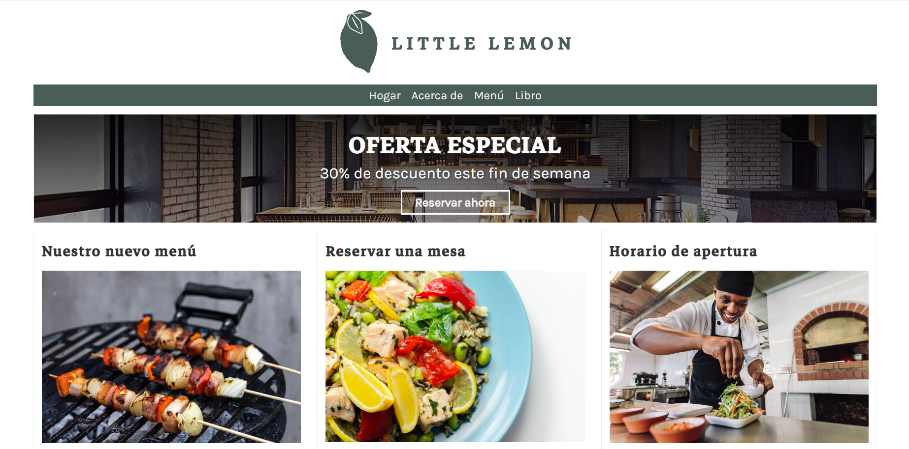

<h1>Django-littlelemon</h1>

<p>Pagina basica realizada como proyecto final para obtener la certificacion de Django web Framework</p>

<br/>
<h2> Para levantar el proyecto</h2>
<br/>


```
python manage.py runserver
```

<h2> Paginas </h2>
<h3>Inicio</h3>

```
 http://127.0.0.1:8000/
```



<br/>
<h3>Acerca de</h3>

```
http://127.0.0.1:8000/about/
```


<br/>
<h3>Menu</h3>

```
http://127.0.0.1:8000/menu/
```


<br/>
<h3>Platos del menu</h3>

```
http://127.0.0.1:8000/menu/1
```


<br/>
<h3>Reservaciones</h3>

```
http://127.0.0.1:8000/book/
```


<h3>Nota: Debe tener instalado python en su sistema.</h3>
<br/>
<h3>Descargar python</h3>
<p><a href="https://www.python.org/downloads/">Python🐍</a></p>


<h3>Instalar django</h3>

```
pip install django
```